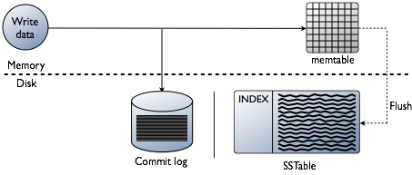

# 数据保存在哪里？

对于每一个column family的数据一共有3个层次的数据存储：memtable，commit log 和SSTable.

<sup>[1](#ref_1)</sup>为了更高的效率，Cassandra在memtable和SSTable里存储数据时不存储列名。例如，如果用下面的CQL插入数据：

```SQL
INSERT INTO k1.t1 (c1) VALUES (v1);
INSERT INTO k2.t1 (c1, c2) VALUES (v1, v2);
INSERT INTO k1.t1 (c1, c3, c2) VALUES (v4, v3, v2);
```
在memtable里, Cassandra保存了下面的数据:

```text
k1 c1:v4 c2:v2 c3:v3
k2 c1:v1 c2:v2
```
在磁盘上的commit log里，Cassandra保存了下面的数据:
```text
k1, c1:v1
k2, c1:v1 C2:v2
k1, c1:v4 c3:v3 c2:v2
```
在磁盘上的SSTable里，Cassandra在memtable被刷新的时候保存下面的数据：
```text
k1 c1:v4 c2:v2 c3:v3
k2 c1:v1 c2:v2
```



## 写路径

当一个写操作发生时，Cassandra将数据保存到内存中的memtable，并且append到磁盘上的commit log。

每个节点上的memtable是当前分区的回写（write-back）缓存，Cassandra从memtable按partition key查询数据。一个column family的数据使用的越多，memtable就越大。Cassandra会为memtable动态分配合适大小的内存，当然你也可以自己管理和最调节memtable的内存分配。和立即写入（write-through）型的缓存不同，memtable会一直保存写入的数据，知道达到配置的阈值，才会被刷新。

当memtable保存的数据超过配置的阈值时，包括索引在内的memtable数据会被加入一个队列，依次被清空和保存到磁盘。刷新数据的时候，Cassandra会先按partition key对memtable中的数据进行排序，然后顺序地（sequentially）保存到磁盘。整个处理过程超级快，因为只有commit log的append和顺序的写入磁盘上的SSTable。

memtable中的数据在被写入SSTable之后，commit log会被清空。commit log的作用是，当发生硬件故障时，用来自动重建memtable中还没有保存到SSTable的数据。

SSTables是不可变的，也就是说，当memtable被刷新和保存为一个SSTable文件之后，SSTable不会被再次写入。因此，一个分许一般会被保存为多个SSTable文件。所以，如果某一行数据不在memtable里，对这行数据的读写需要遍历所有的SSTable。这也是为什么Cassandra的读要比写慢的原因。

## 数据压缩（Compaction）

为了提升读的性能和释放磁盘空间，Cassandra会周期性的通过合并多个SSTable文件中相同partition key的数据的方式进行做数据压缩。

<sup>[2](#ref_2)</sup>Cassandra内建了两种数据压缩策略： SizeTieredCompactionStrategy和LeveledCompactionStrategy.

* SizeTieredCompactionStrategy适用于写操作更多的情况
* LeveledCompactionStrategy适用于读操作更多的情况

关于数据压缩策略的更多介绍，参见[When to Use Leveled Compaction](http://www.datastax.com/dev/blog/when-to-use-leveled-compaction)和[Leveled Compaction in Apache Cassandra](http://www.datastax.com/dev/blog/leveled-compaction-in-apache-cassandra).

## 参考

1. <a name="ref_1"></a>http://www.datastax.com/documentation/cassandra/2.0/cassandra/dml/dml_stores_data_c.html
2. <a name="ref_2"></a>http://www.datastax.com/documentation/cassandra/2.0/cassandra/dml/dml_write_path_c.html
