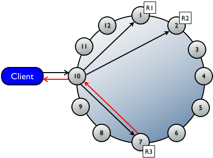

# Write Requests

[1](#ref_1)For nodes in the same local data center of the coordinator, the coordinator sends a write request to all replicas that own the row being written. As long as all replica nodes are up and available, they will get the write regardless of the [consistency level](../replication/turnable_consistency.html) specified by the client. The write consistency level determines how many replica nodes must respond with a success acknowledgment in order for the write to be considered successful.

For example, in a single data center 10 node cluster with a replication factor of 3, an incoming write will go to all 3 nodes that own the requested row. If the write consistency level specified by the client is ONE, the first node to complete the write responds back to the coordinator, which then proxies the success message back to the client. When a node writes and responds, that means it has written to the commit log and puts the mutation into a memtable.

[2](#ref_2)In multiple data center deployments, Cassandra optimizes write performance by choosing one coordinator node in each remote data center to handle the requests to replicas within that data center. The coordinator node contacted by the client application only needs to forward the write request to one node in each remote data center.

If using a consistency level of ONE or LOCAL_QUORUM, only the nodes in the same data center as the coordinator node must respond to the client request in order for the request to succeed. This way, geographical latency does not impact client request response times.

## Reference

1. http://www.datastax.com/documentation/cassandra/2.0/cassandra/architecture/architectureClientRequestsWrite.html
2. http://www.datastax.com/documentation/cassandra/2.0/cassandra/architecture/architectureClientRequestsMultiDCWrites_c.html
